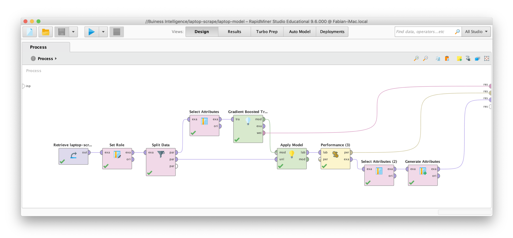

# Laptop price-prediction with machine learning
## Java for Data Science: Thema 4

> Author: Fabian Kuhn

> Date: 2020-06-07

This project shows, how data can be scraped using silenium. Aim ist to receive information about laptops from galaxus to predict prices with machine learning. After scraping the data, it is prepared and then analysed with RapidMiner.

## Documentation
- Presentation documentation: [TI-Präsentation.pdf](_docs/TI-Präsentation.pdf)
- SQL Results in H2
    - Install Dependencies: `$ mvn install`
    - Run Server: `$ mvn spring-boot:run`
    - Open H2 console: [H2-Console](http://localhost:8081/console/login.jsp?jsessionid=896aecddd4c34229b7f00fbe25716123)
    - JDBC URL: jdbc:h2:./db_scrape
    - Username: test
    - Password: \<empty\>
- SQL Raw Data Export: [PRODUCTRAW.sql](src/main/resources/PRODUCTRAW.sql)
- SQL Processed Data Export: [PRODUCT.sqll](src/main/resources/PRODUCT.sql)

## Project structure
```
├── _docs
│   ├── TI-Präsentation.pdf
│   └── model.png
├── db_scrape.mv.db
├── pom.xml
└── src
    └── main
        ├── java
        │   └── ch
        │       └── zhaw
        │           └── ti
        │               ├── TiApplication.java
        │               ├── product
        │               │   ├── Product.java
        │               │   ├── ProductConverter.java
        │               │   └── ProductRepository.java
        │               ├── productRaw
        │               │   ├── ProductRaw.java
        │               │   ├── ProductRawRepository.java
        │               │   └── ProductRawService.java
        │               └── scrape
        │                   ├── ProductScraper.java
        │                   ├── UrlScraper.java
        │                   └── WebDriverConfig.java
        └── resources
            ├── PRODUCT.sql
            ├── PRODUCTRAW.sql
            ├── application.properties
            └── geckodriver

```

## Gradient Boost Model


## H2 Queries Used
Write products to csv
```h2
call CSVWRITE ( '/Users/fabiankuhn/Desktop/products.txt', 'SELECT * FROM Product' ) 
```

Export SQL Statments
```h2
script simple columns to '/Users/fabiankuhn/Desktop/Product.sql' table "Product";
```

Number of features
```sql
SELECT count(*) FROM INFORMATION_SCHEMA.Columns where TABLE_NAME = 'PRODUCTRAW'
```

See Progress while scraping
```sql
select (100.0*count(displayResolution))/count(*) from productraw
```

See Progress
```sql
SELECT 
    (select count(*) 
    from productraw
    where displayresolution is not null or deviceweight is not null) AS finished,
    count(*) as sum
FROM
    productraw
```


## ModelMapper
The Modelmapper is used for data conversion. Specifically the `Converter` helps to map attributes to a new entity.

#### Converter
https://www.gitmemory.com/issue/modelmapper/modelmapper/464/490810070

Code works with Lambda conversion
```java
// Code works with Lambda conversion
Converter<ProductRaw, Product> converter = context -> {

    // Get Source and Destination
    ProductRaw productRaw = context.getSource();
    Product product = context.getDestination();
}

modelMapper.emptyTypeMap(ProductRaw.class, Product.class).setConverter(converter);
```

Code works with full implementation of Convertor Class
```java
Converter<ProductRaw, Product> converter2 = new Converter<>(){

    @Override
    public Product convert(MappingContext<ProductRaw, Product> mappingContext) {
        ProductRaw productRaw = context.getSource();
        Product product = context.getDestination();
        return null;
    }
};

modelMapper.addConverter(converter);
```

Skip properties
```java
PropertyMap<ProductRaw, Product> skipMap = new PropertyMap<ProductRaw, Product>(){
    @Override
    protected void configure() {
        skip(destination.getPreis());
        skip(destination.getGewicht());
    }
};
```

Add skipMap
```java
typeMap.addMappings(skipMap);
```

Add Converter in addition to typeMap

```java
TypeMap<ProductRaw, Product> typeMap = modelMapper.createTypeMap(ProductRaw.class, Product.class);
typeMap.setPreConverter(converter);
```
